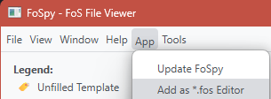
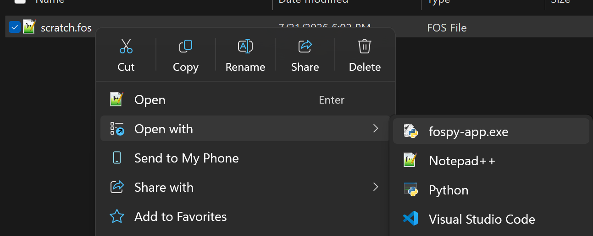
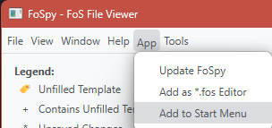
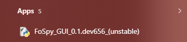

# Getting Started with FoSpy

## Software

### (Required) Python 

A stable runtime of Python \>= 3.11 is required to run FoSpy. Since many scientists have off-market versions of Python packaged with programs like GSAS-II or Anaconda, it is recommended to start with a fresh runtime of Python using the new [Python install manager](https://www.python.org/downloads/release/pymanager-262/). The install manager also has commands for checking current installed runtimes.

### (Optional) Git

Git is only required if you want access to [incoming features](https://errthumt.github.io/FoSpy/incoming/) that have not yet been published to PyPI.

Git is the version-control system used by GitHub for downloading and tracking files. Having Git installed allows installation of the most recent development build directly from the GitHub instead of the pre-built versions on PyPI.

- [Git Installer Downloads](https://git-scm.com/install/windows)

## Virtual Environments
A [virtual environment](https://docs.python.org/3/library/venv.html) is a simple way of making sure that Python packages installed for various projects do not interfere with each others' source code. Virtual environments rely on the base Python compiler, but any packages installed to a virtual environment are only accessible when that environment is "activated". Here, I'm creating a virtual environment in a folder titled `.venv_FoSpy`:

**Note:** The first time the FoSpy GUI is opened in a python environment containing unexpected packages, it will automatically prompt you to set up its own virtual environment in a folder of your choosing.

=== "Windows"

    ```cmd
    python -m venv .venv_FoSpy
    ```

=== "macOS/Linux"

    ```bash
    python3 -m venv .venv_FoSpy
    ```

## Installing FoSpy

### Stable Releases
FoSpy is published as a [PyPI project](https://pypi.org/project/FoSpy/), meaning that it can be downloaded and installed directly by Python's `pip` module.

Note:
- The activation of the new virtual environment before the installation command makes sure that FoSpy will not interfere with other packages on the base python install.
- Including `[app]` in the install command ensures that all the extra packages required for the GUI are also installed.

=== "Windows"

    ```cmd
    .venv_FoSpy\Scripts\activate
    python -m pip install --upgrade FoSpy[app]
    ```

=== "macOS/Linux"

    ```bash
    call .venv_FoSpy/bin/activate
    python3 -m pip install --upgrade FoSpy[app]
    ```

### Unstable GitHub Builds
If [Git](#optional-git) is installed, you can point `pip` to the GitHub URL to get the most recent incoming features.

=== "Windows"

    ```cmd
    .venv_FoSpy\Scripts\activate
    python -m pip install --upgrade "FoSpy[app] @ git+https://github.com/errthumt/FoSpy.git@main"
    ```

=== "macOS/Linux"

    ```bash
    source .venv_FoSpy/bin/activate
    python3 -m pip install --upgrade "FoSpy[app] @ git+https://github.com/errthumt/FoSpy.git@main"
    ```


## Opening the App for the First Time.
Once installed, the `fospy-app` command is available inside your activated environment to launch the FoSpy GUI

=== "Windows"

    ```cmd
    .venv_FoSpy\Scripts\activate
    fospy-app
    ```

=== "macOS/Linux"

    ```bash
    source .venv_FoSpy/bin/activate
    fospy-app
    ```

## Setting Up for Future Use

### FoS-style Editor Registration
You can register the GUI as an editor for recognized FoS extensions (`*.fos, *.fosx, *.json`). This allows the app to show up as as an option in "Open With..." context menus.





### Windows Start Menu
Windows users can also add the GUI as a Start shortcut so that it will show up in the search menu.



